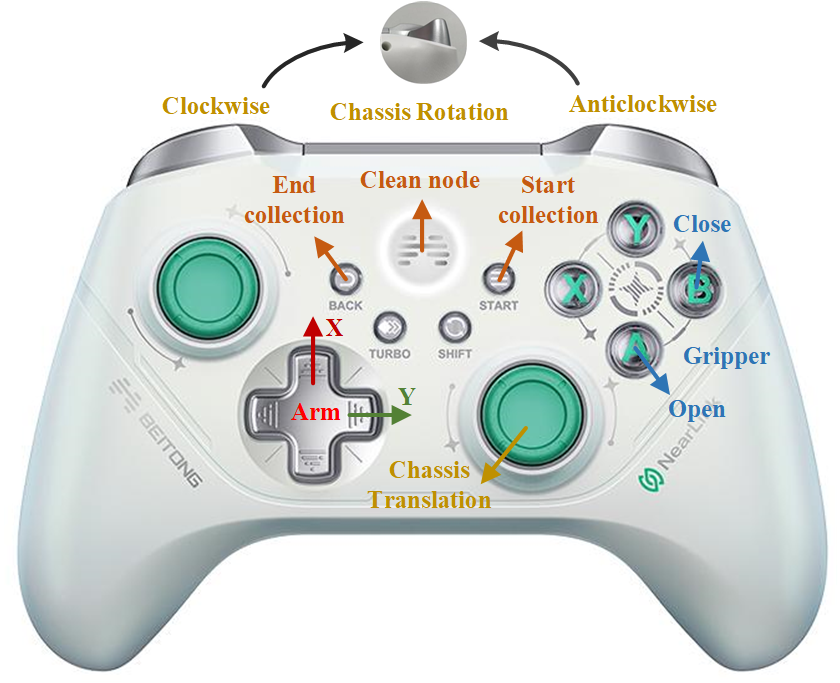

<div align="center">
    
</div>

<div align="center">
English | [简体中文](README_zh-CN.md)  
</div>

# RoboMatrix: A Skill-centric Hierarchical Framework for Scalable Robot Task Planning and Execution in Open-World

## 📝[Paper](https://arxiv.org/abs/2412.00171) | 🌍[Project Page](https://robo-matrix.github.io/) | 🛢️[Data](https://huggingface.co/datasets/WayneMao/RoboMatrix)
  
<!--  -->
<div align="center">
    
</div>

<!-- ## 📰 News -->

## 📰 Release

- [2024/12/04] We have released the RoboMatrix supervised fine-tuning (SFT) dataset, which contains 1,500 high-quality human-annotated demonstration videos.

## Demos
### Dynamic Adversarial Interaction
<!-- <video src="https://robo-matrix.github.io/static/videos/crossing_obstacles_with_disturbance.mp4" controls="controls" style="max-width: 100%; height: auto;">
</video> -->
<!-- https://private-user-images.githubusercontent.com/35285052/392064253-ff1d7e2a-8650-430d-a60e-15bffcc237e2.mp4 -->
https://private-user-images.githubusercontent.com/35285052/392642975-b78e28aa-45c2-4bb0-9e70-b6a08c678f85.mp4


## Hardware Preparation
We use robots from DJI’s **RoboMaster** series as the hardware platform, including the Engineering Robot (EP) and
the Warrior Robot (S1). These two forms of robots share some common components, including the mobile chassis, monocular RGB camera, audio module, and controller. Additionally, each robot is equipped with a unique set of components to perform specific tasks, such as the target shooting capability of the S1 robot and the target grasping capability of the EP robot.

We modified the EP robot by mounting the camera above the robot to prevent the camera’s viewpoint from changing with the movement of the robotic arm. See [3D_Printing](Hardware/3D_Printing) for the parts of the designed camera mount.

We use **BEITONG ASURA 2PRO+ GAMEPAD NEARLINK VERSION** as the controller for robot teleoperation.

## Environment Configuration
We developed RoboMatrix using the ROS2 framework on Ubuntu 20.04. You can follow the [official installation guidance](https://docs.ros.org/en/foxy/Installation/Ubuntu-Install-Debians.html) to complete the installation of the Foxy distro of ROS2 and the necessary tools. In addition, we passed the test on Ubuntu 22.04 ([ROS2 Humble](https://docs.ros.org/en/humble/Installation/Ubuntu-Install-Debians.html)), which may provide some reference for you if you want to install RoboMatrix in a later version of Ubuntu.

We provide a general installation procedure for ROS2, this might give you some help. **If you already have it installed on your system, please skip this step.**

### Step 1: Set UTF-8
Open a terminal, check weather your system supports UTF-8.
```bash
locale
```
If not support (no output in terminal), please install.
```bash
sudo locale-gen en_US en_US.UTF-8
sudo update-locale LC_ALL=en_US.UTF-8 LANG=en_US.UTF-8
export LANG=en_US.UTF-8
```

### Step 2: Set Ubuntu Universe
Open a terminal, check weather your system supports Ubuntu Universe.
```bash
apt-cache policy | grep universe
```
If not support (no output in terminal), please install.
```bash
sudo apt install software-properties-common
sudo add-apt-repository universe
```

### Step 3: Add ROS2 software source and key
```bash
sudo apt update && sudo apt install curl gnupg2 lsb-release
sudo curl -sSL https://raw.githubusercontent.com/ros/rosdistro/master/ros.key  -o /usr/share/keyrings/ros-archive-keyring.gpg
echo "deb [arch=$(dpkg --print-architecture) signed-by=/usr/share/keyrings/ros-archive-keyring.gpg] http://packages.ros.org/ros2/ubuntu $(lsb_release -cs) main" | sudo tee /etc/apt/sources.list.d/ros2.list > /dev/null
```

### Step 4: Get ROS2
Install the specified version of ROS2, using **Foxy** as an example.
```bash
sudo apt update
sudo apt install ros-foxy-desktop
```

### Step 5: Source bash
```bash
echo "source /opt/ros/foxy/setup.bash" >> ~/.bashrc
source .bashrc
```

### Step 6: Test demo
Open a terminal, start talker node.
```bash
ros2 run demo_nodes_cpp talker
```
Open a new terminal, start listener node.
```bash
ros2 run demo_nodes_cpp listener
```

### Step 7: Install colcon
```bash
sudo apt install python3-colcon-common-extensions
```

## 🛠️ Installation
### Build workspace
```bash
git clone https://github.com/WayneMao/RoboMatrix.git
cd ~/RoboMatrix && colcon build
```

### RoboMaster SDK
Install dependencies.
```bash
sudo apt install libopus-dev python3-pip
python3 -m pip install -U numpy numpy-quaternion pyyaml
```
Install SDK from source code.
```bash
python3 -m pip install git+https://github.com/jeguzzi/RoboMaster-SDK.git
python3 -m pip install git+https://github.com/jeguzzi/RoboMaster-SDK.git#"egg=libmedia_codec&subdirectory=lib/libmedia_codec"
```

### Dependencies
```bash
pip install -r requirements.txt
pip install torch==2.0.1 torchvision==0.15.2 torchaudio==2.0.2 --index-url https://download.pytorch.org/whl/cu118
```

### Grounding-DINO-1.5-API
```bash
cd ~/RoboMatrix/robomatrix_client/robomatrix_client
git clone https://github.com/IDEA-Research/Grounding-DINO-1.5-API.git
cd Grounding-DINO-1.5-API
pip install -v -e .
```

## Usage
### Connect to RoboMaster
Download the RoboMaster official APP, follow the instructions to connect the robot to WiFi (only WiFi5), and connect the computer to the same WiFi to complete the connection.

### Data Collection



**Step 1: Start launch file**
```bash
source ~/RoboMatrixinstall/setup.bash
ros2 launch robomaster_ros collect_data.launch.py name:=example idx:=1 dir:=~/RoboMatrixDatasets
```

|Parameter |Definition |Example|
|----- |----- |-----|
|name |A custom task name |move_to_box|
|idx |The sequence number of the current episode of the task |10|
|dir |The folder where the data is saved | ~/MyDatasets|

*NOTEs*
1. Make sure the robot is successfully connected to the specified WIFI before launching the launch file.
2. Make sure the controller's button mode is **XBOX**, which you can view in the terminal. In the case of **BEITONG**, long press the `POWER` button to switch.
3. Ensure that the robot initialization is complete before proceeding with the following operations.

**Step 2: Start collecting**

By pressing the `START` button, the robot's status begins to be recorded and the other buttons on the handle are activated, allowing control of the robot's movement.

**Step 3: Control the robot**

The control mode of the robot chassis is speed control. The `RS` axis controls the translation speed of the chassis, and the `LT` and `RT` axes control the rotation speed of the chassis.

The control mode of the robot arm is position control. The `HAT` key set changes the position of the end of the robot arm in the plane. Each press moves its position a fixed distance in the specified direction.

The gripper control is binarized. The `A` button controls the gripper open to the maximum, and the `B` button controls the gripper closed to the maximum.

**Step 4: Save data**

Press the `BACK` button to save the data, then press the `POWER` button to clean the ROS2 node and wait for the video to finish saving.

### Task Execution


## TODO
- [ ] Package Docker
- [X] 🤗 Release Supervised Fine-tuning dataset
- [ ] Optimize VLA ROS communication
- [ ] Open source VLA Skill model code
- [ ] Release VLA Skill model weights
- [ ] Open source Shooting code

## Citation

If you find our work helpful, please cite us:

```bibtex
@article{mao2024robomatrix,
  title={RoboMatrix: A Skill-centric Hierarchical Framework for Scalable Robot Task Planning and Execution in Open-World},
  author={Mao, Weixin and Zhong, Weiheng and Jiang, Zhou and Fang, Dong and Zhang, Zhongyue and Lan, Zihan and Jia, Fan and Wang, Tiancai and Fan, Haoqiang and Yoshie, Osamu},
  journal={arXiv preprint arXiv:2412.00171},
  year={2024}
}
```

## Acknowledgments
- Implementation of Vision-Language-Action (VLA) skill model is based on [LLaVA](https://github.com/haotian-liu/LLaVA/).  
- RoboMatrix-ROS is based on official [RoboMaster-SDK](https://github.com/dji-sdk/RoboMaster-SDK), modified [RoboMaster-SDK](https://github.com/jeguzzi/RoboMaster-SDK) and [ROS2](https://github.com/ros2).
- Some additional libraries: [Grounding-DINO-1.5](https://github.com/IDEA-Research/Grounding-DINO-1.5-API), [YOLO-World](https://github.com/AILab-CVC/YOLO-World).


---
## WeChat

