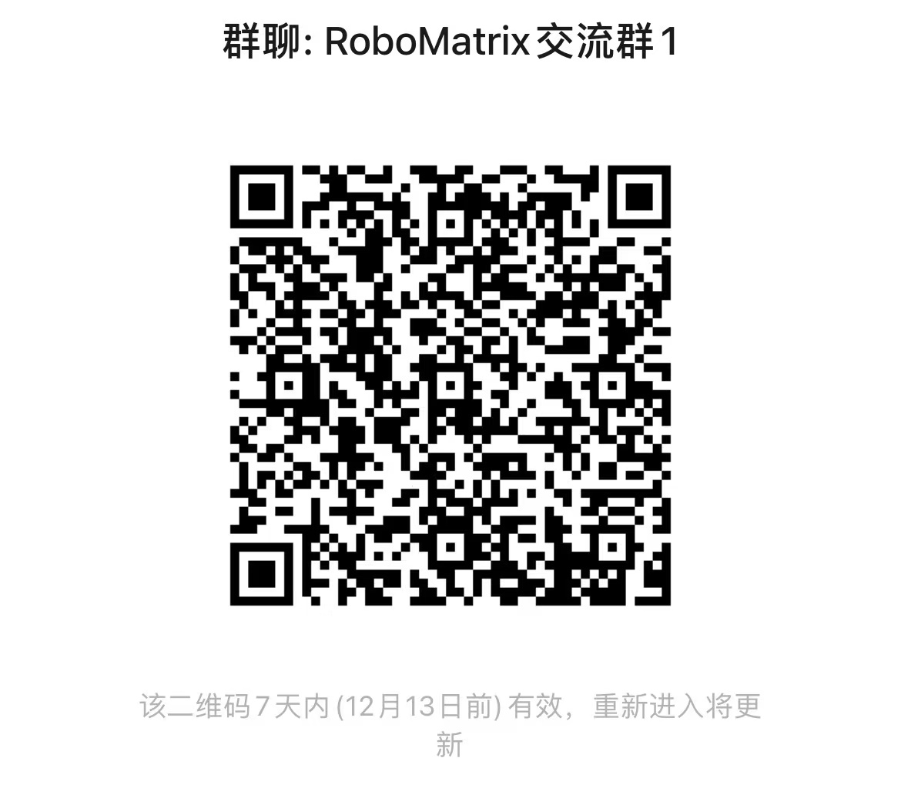

<div align="center">
    
</div>

<div align="center">

English | [简体中文](README_zh-CN.md)  

</div>

# RoboMatrix: A Skill-centric Hierarchical Framework for Scalable Robot Task Planning and Execution in Open-World

### 📝[Paper](https://arxiv.org/abs/2412.00171) | 🌍[Project Page](https://robo-matrix.github.io/) | 🛢️[Data](https://huggingface.co/datasets/WayneMao/RoboMatrix)
  


## 📰 News

## Demo
### Dynamic Adversarial Interaction
<!-- <video src="https://robo-matrix.github.io/static/videos/crossing_obstacles_with_disturbance.mp4" controls="controls" style="max-width: 100%; height: auto;">
</video> -->
<!-- https://private-user-images.githubusercontent.com/35285052/392064253-ff1d7e2a-8650-430d-a60e-15bffcc237e2.mp4 -->
https://private-user-images.githubusercontent.com/35285052/392642975-b78e28aa-45c2-4bb0-9e70-b6a08c678f85.mp4

## 🛠️ Installation
### 1. Install ROS 2

**Note: If ROS2 is already installed on your system, please skip this step.**

**ROS2 distro for your Ubuntu**
* Ubuntu 20.04 ---> ROS2 Foxy ---> [official installation guidance](https://docs.ros.org/en/foxy/Installation/Ubuntu-Install-Debians.html)
* Ubuntu 22.04 ---> ROS2 Humble ---> [official installation guidance](https://docs.ros.org/en/humble/Installation/Ubuntu-Install-Debians.html)

**Install colcon tool**
```bash
sudo apt install python3-colcon-common-extensions
```

### 2. Build workspace
```bash
mkdir -p ~/RoboMatrix/src && cd ~/RoboMatrix/src
git clone https://github.com/WayneMao/RoboMatrix.git
cd ~/RoboMatrix && colcon build
```

### 3. Install dependencies
```bash
sudo apt install libopus-dev python3-pip
python3 -m pip install -U numpy numpy-quaternion pyyaml

# Install RoboMaster-SDK
python3 -m pip install git+https://github.com/jeguzzi/RoboMaster-SDK.git
python3 -m pip install git+https://github.com/jeguzzi/RoboMaster-SDK.git#"egg=libmedia_codec&subdirectory=lib/libmedia_codec"

# install dependencies and torch
pip install -r requirements.txt
pip install torch==2.0.1 torchvision==0.15.2 torchaudio==2.0.2 --index-url https://download.pytorch.org/whl/cu118
```
### 4. Third party
**Grounding-DINO-1.5-API**
```bash
cd src/robomatrix_client/robomatrix_client
git clone https://github.com/IDEA-Research/Grounding-DINO-1.5-API.git
cd Grounding-DINO-1.5-API
pip install -v -e .
```
## Deployment on Real-Robots

## TODO
- [ ] Package Docker
- [X] 🤗 Release Supervised Fine-tuning dataset
- [ ] Optimize VLA ROS communication
- [ ] Open source VLA Skill model code
- [ ] Release VLA Skill model weights
- [ ] Open source Shooting code

## Citation

If you find our work helpful, please cite us:

```bibtex
@article{mao2024robomatrix,
  title={RoboMatrix: A Skill-centric Hierarchical Framework for Scalable Robot Task Planning and Execution in Open-World},
  author={Mao, Weixin and Zhong, Weiheng and Jiang, Zhou and Fang, Dong and Zhang, Zhongyue and Lan, Zihan and Jia, Fan and Wang, Tiancai and Fan, Haoqiang and Yoshie, Osamu},
  journal={arXiv preprint arXiv:2412.00171},
  year={2024}
}
```

## Acknowledgments
- Implementation of Vision-Language-Action (VLA) skill model is based on [LLaVA](https://github.com/haotian-liu/LLaVA/).  
- RoboMatrix-ROS is based on [RoboMaster-SDK](https://github.com/dji-sdk/RoboMaster-SDK) and [ROS2](https://github.com/ros2).
- Some additional libraries: [Grounding-DINO-1.5](https://github.com/IDEA-Research/Grounding-DINO-1.5-API), [YOLO-World](https://github.com/AILab-CVC/YOLO-World).


---
## WeChat
